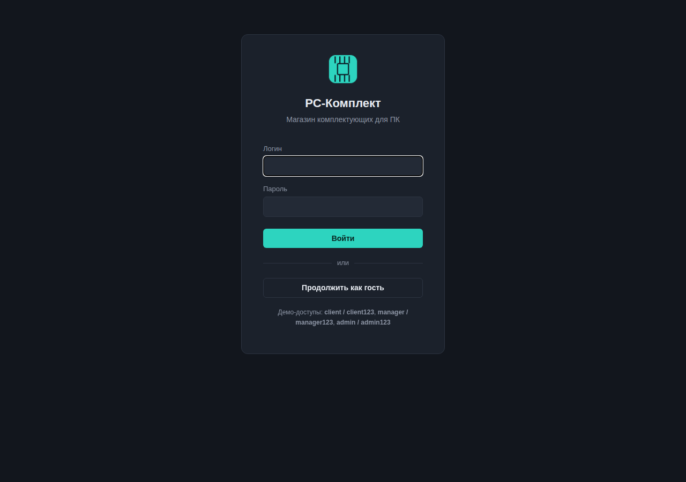
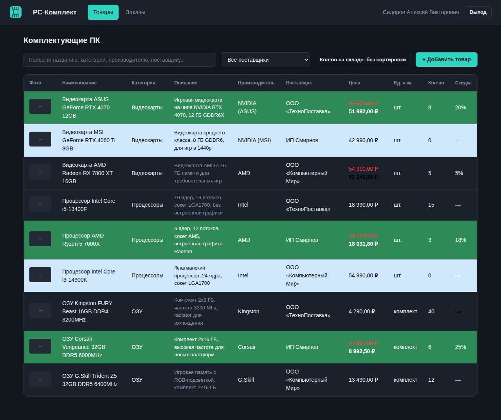
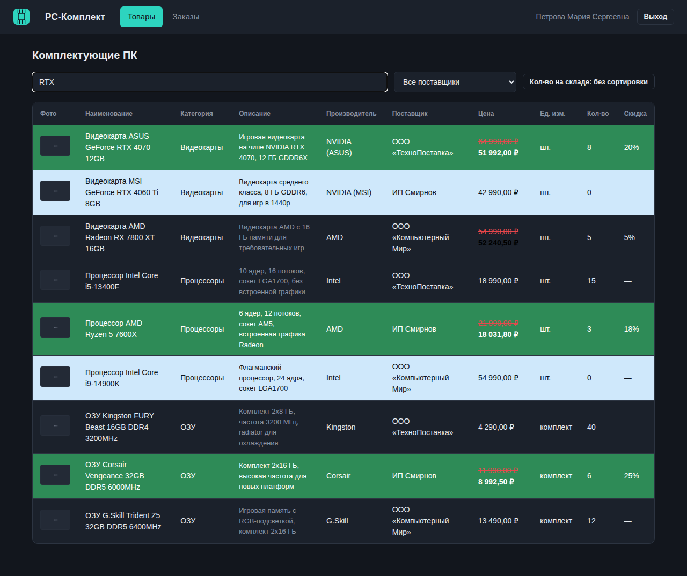
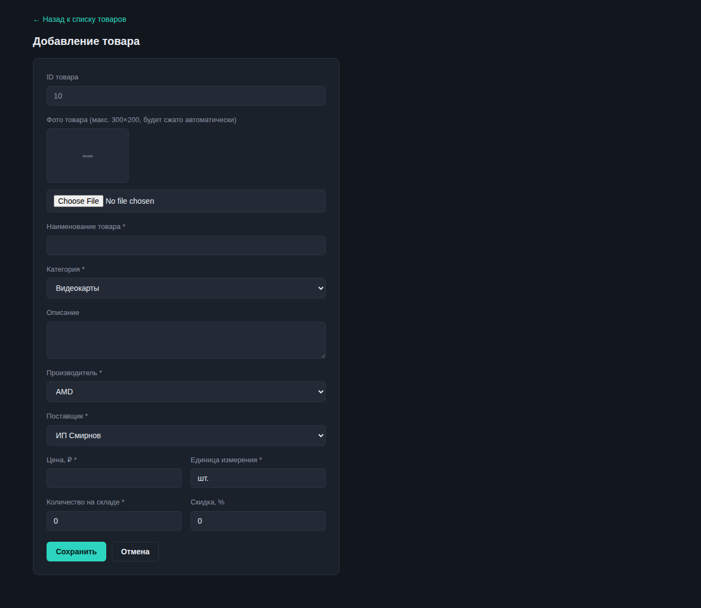
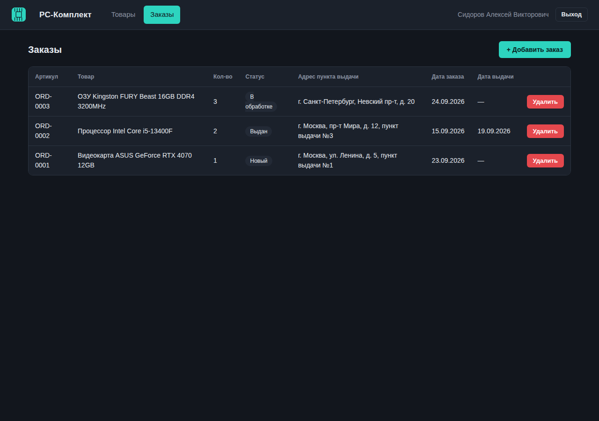
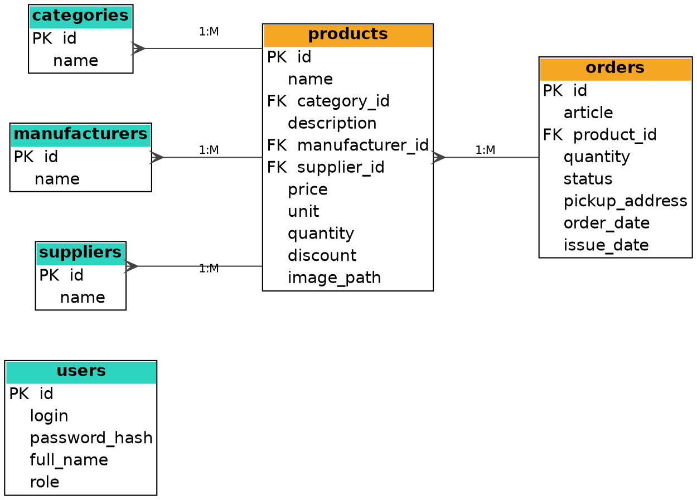

# PC-Комплект — магазин комплектующих ПК

Веб-приложение на Flask (Python) для магазина комплектующих ПК (видеокарты,
процессоры, ОЗУ). Реализовано как демонстрационный экзамен КОД 09.02.07:
база данных, авторизация с разграничением ролей, каталог товаров с поиском
и фильтрацией в реальном времени, управление товарами и заказами.

## Роли пользователей

| Роль          | Возможности                                                           |
|---------------|------------------------------------------------------------------------|
| Гость         | Просмотр товаров (без поиска/фильтра/сортировки)                        |
| Клиент        | То же, после авторизации                                               |
| Менеджер      | Просмотр товаров с поиском/фильтром/сортировкой, просмотр заказов        |
| Администратор | Полный доступ: CRUD товаров и заказов                                   |

## Скриншоты

**Окно входа**



**Каталог товаров (администратор)** — подсветка строк: скидка >15% — зелёным,
нет в наличии — голубым, старая цена зачёркнута



**Поиск в реальном времени (менеджер)**



**Форма добавления товара** — с загрузкой и авто-сжатием фото до 300×200



**Заказы (администратор)**



**ER-диаграмма базы данных**



## Технологии

Python, Flask, Flask-SQLAlchemy, SQLite, Jinja2, Pillow, ванильный JS/CSS.

## Установка и запуск

```bash
python -m venv venv
source venv/bin/activate        # Windows: venv\Scripts\activate
pip install -r requirements.txt

python init_db.py               # создаёт shop.db и тестовые данные
python app.py                   # http://127.0.0.1:5000
```

## Тестовые учётные записи

| Логин   | Пароль      | Роль          |
|---------|-------------|---------------|
| client  | client123   | Клиент        |
| manager | manager123  | Менеджер      |
| admin   | admin123    | Администратор |

Либо кнопка «Продолжить как гость» на странице входа.

## Структура проекта

```
pc_shop/
├── app.py                  # маршруты, авторизация, CRUD, загрузка изображений
├── models.py                # модели SQLAlchemy
├── init_db.py                 # создание БД и тестовые данные
├── requirements.txt
├── db/
│   ├── schema.sql             # SQL-скрипт структуры БД (3НФ)
│   ├── er_diagram.dot          # исходник ER-диаграммы (Graphviz)
│   └── er_diagram.pdf           # ER-диаграмма в PDF
├── docs/screenshots/          # скриншоты для этого README
├── templates/                  # HTML-шаблоны (Jinja2)
└── static/
    ├── css/style.css
    ├── js/products.js          # realtime поиск/фильтр/сортировка
    ├── img/
    └── uploads/                # загруженные фото товаров
```

## Соответствие модулям задания

- **Модуль 1** — БД в 3НФ, 6 таблиц, ER-диаграмма, тестовые данные.
- **Модуль 2** — окно входа, гостевой режим, единый стиль оформления.
- **Модуль 3** — поиск/сортировка/фильтр в реальном времени, добавление/
  редактирование/удаление товара, валидация, запрет удаления товара из заказа.
- **Модуль 4** — раздел «Заказы», CRUD заказов только у администратора.
